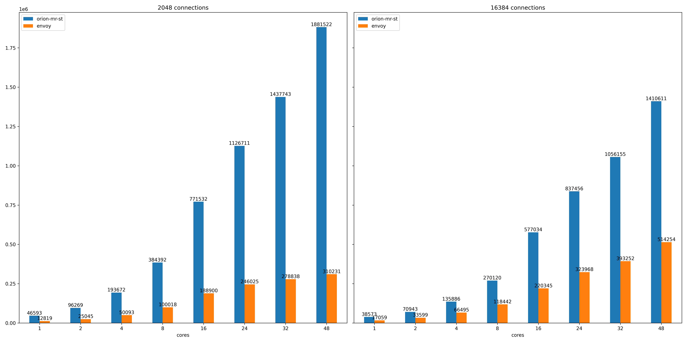
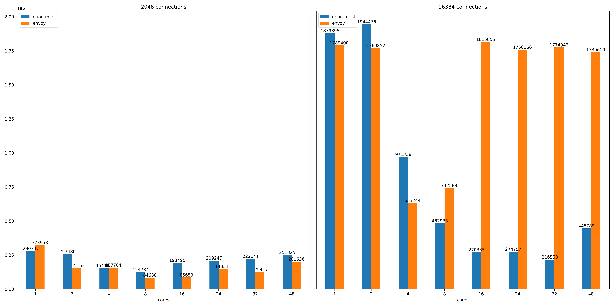
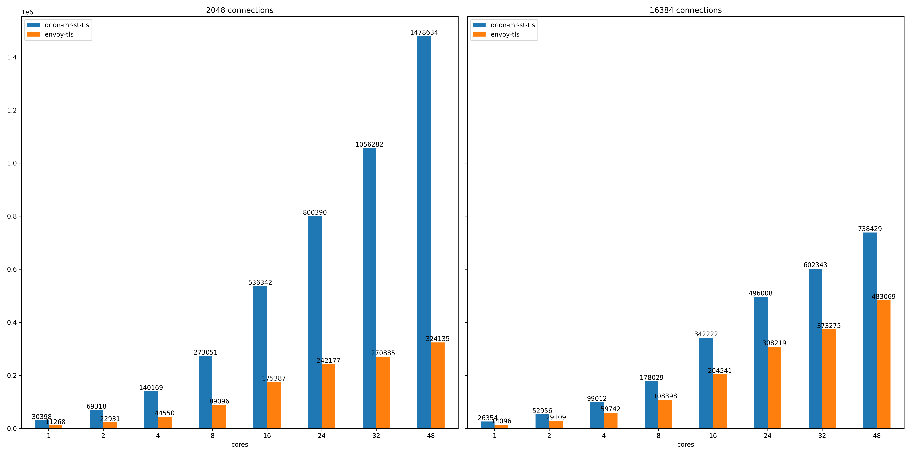
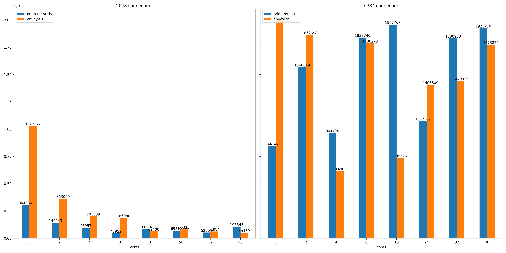
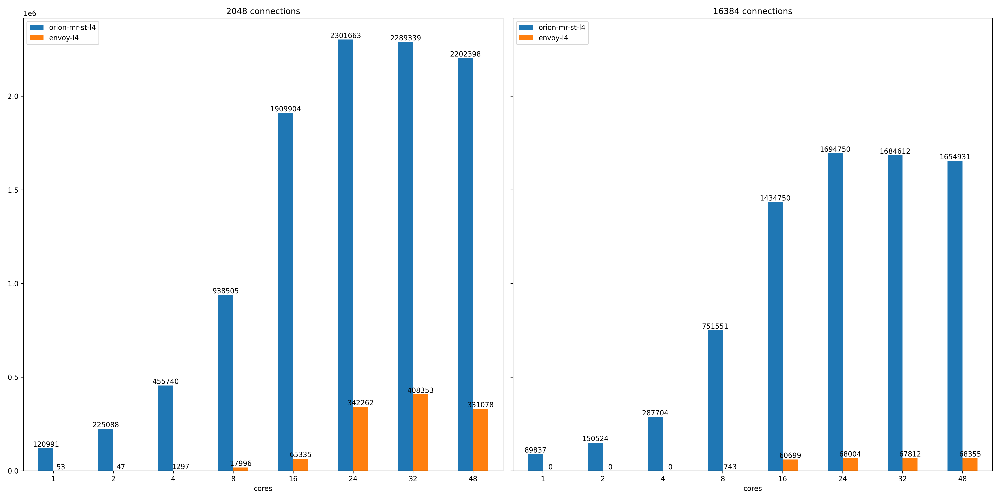
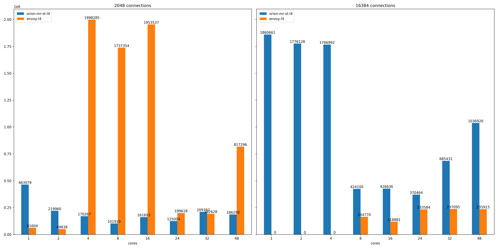
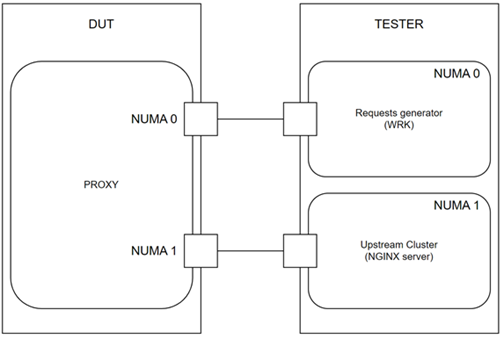

# Orion Proxy Performance Benchmarking

## Results

### HTTP 

#### Requests per second 

#### Latency in microseconds

### HTTPS
#### Requests per second 

#### Latency in microseconds

### TCP
#### Requests per second 

#### Latency in microseconds

## Test Methodology and Testbed

* Requests generator (wrk):
  - 2048 and 16384 connections tests
  - 45s duration per test
  - 36 threads/18 cores for the application on NUMA0
  - 6 cores assigned to IRQ handling on NUMA0
  - Measures req/s, throughput, latency (min, max, mean, 99.9th, 99.999th)
* Upstream Cluster (Nginx):
  - In-memory direct response of 12B size
  - 17 cores assigned to the application on NUMA1
  - 7 cores assigned to IRQ handling on NUMA1
  - 2.6M RPS à hard-limit of the server
  - Measures #connections established upstream

* DUT (Proxy):
  - Comparison Envoy, Ng-proxy, and Nginx
  - Scaling tested with 1, 2, 4, 8, 16, 24, 32 cores assigned to the proxy
  - TCP termination toward single upstream cluster

* DUT (Tunings):
  - IRQ affinity
  - 8 cores reserved for the IRQ affinity.
  - 24 cores allocated for proxy (per NUMA node).
* All interfaces are 25Gbps Mellanox and Intel NICs
